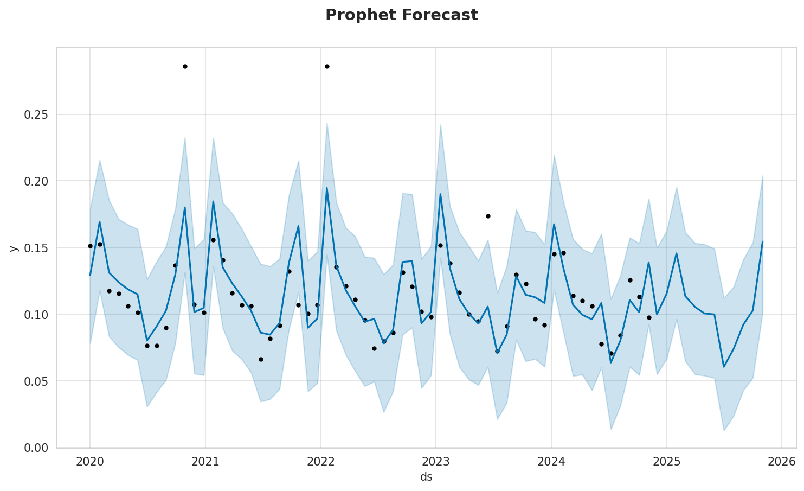
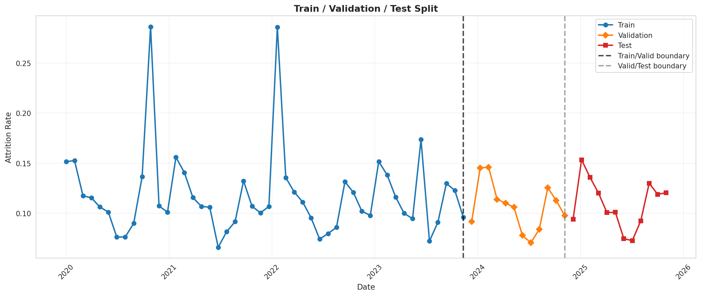

# Time Series Forecasting for Employee Attrition

A production-grade forecasting pipeline that predicts monthly employee attrition rates using two powerful time series methods: **SARIMA** and **Facebook Prophet**. Built to demonstrate expertise in time series analysis, seasonality modeling, and predictive workforce analytics — core capabilities for HCM/HR software companies that provide workforce planning tools and schedule forecasting.

---

## Table of Contents

1. [Project Overview](#project-overview)
2. [What Is Time Series Forecasting?](#what-is-time-series-forecasting)
3. [Understanding SARIMA](#understanding-sarima)
4. [Understanding Facebook Prophet](#understanding-facebook-prophet)
5. [Model Inputs and Target Variable](#model-inputs-and-target-variable)
6. [SARIMA vs Prophet: When to Use Which](#sarima-vs-prophet-when-to-use-which)
7. [Dataset](#dataset)
8. [Project Structure](#project-structure)
9. [Pipeline Walkthrough](#pipeline-walkthrough)
10. [Results](#results)
11. [Getting Started](#getting-started)
12. [Key Design Decisions](#key-design-decisions)
13. [Production Considerations](#production-considerations)

---

## Project Overview

Employee attrition — the rate at which people leave an organization — is one of the most important metrics in workforce planning. If you can predict how many employees will leave next month (or next quarter), you can plan hiring, manage budgets, and reduce the cost of unexpected turnover.

This project builds a complete end-to-end forecasting pipeline:

1. **Generate** realistic synthetic attrition data with seasonal patterns and trends
2. **Explore** the data to understand its structure (trends, seasonality, autocorrelation)
3. **Preprocess** the data (stationarity testing, differencing, train/test splitting)
4. **Model** the data using two approaches: SARIMA and Facebook Prophet
5. **Compare** the models side by side to determine which performs best

All data is stored in AWS S3, and each step is implemented as a self-contained Jupyter notebook with a clean class-based architecture.

---

## What Is Time Series Forecasting?

A **time series** is simply a sequence of data points collected over time. Examples include daily stock prices, monthly sales figures, or — in this case — monthly employee attrition rates.

**Time series forecasting** is the process of using historical time-ordered data to predict future values. Unlike other machine learning problems where data points are independent, time series data has a crucial property: **order matters**. What happened last month tells you something about what will happen next month.

### Key Concepts

Before diving into the models, here are the building blocks you need to understand:

**Trend** is the long-term direction of the data. Is attrition gradually increasing year over year? That upward drift is the trend. Think of it as the general trajectory if you zoomed out and squinted at the chart.


*Company-wide monthly attrition rate over 6 years. The red line shows the overall trend with seasonal fluctuations.*

**Seasonality** refers to repeating patterns at fixed intervals. In employee attrition, there are predictable spikes every January and February (people leave after receiving annual bonuses) and dips every summer (people rarely quit during vacation season). These patterns repeat every 12 months like clockwork.


*Distribution of attrition rate by calendar month. Notice the clear peaks in months 1-2 (January/February) and the dip in months 6-7 (summer).*

**Stationarity** is a statistical property that means the data's behavior doesn't change over time — its mean, variance, and autocorrelation structure stay constant. Most forecasting models require stationary data. If your data has an upward trend, you need to remove that trend (usually by "differencing" — subtracting each value from the previous one) before modeling.


*The 12-month rolling mean (orange) and standard deviation band help assess whether the data's statistical properties are stable over time.*

**Autocorrelation** measures how much a value at one time point correlates with values at previous time points (called "lags"). If this month's attrition is high, is next month's also likely to be high? Autocorrelation quantifies that relationship. Two key tools visualize this:
- **ACF (Autocorrelation Function)**: Shows correlation between the series and its lagged versions
- **PACF (Partial Autocorrelation Function)**: Shows the *direct* correlation at each lag, removing the influence of intermediate lags


*The ACF (left) shows how the series correlates with its past values at each lag. The PACF (right) isolates the direct effect of each lag. These plots directly inform the choice of SARIMA parameters (p, q, P, Q).*

---

## Understanding SARIMA

### What Is ARIMA?

**ARIMA** stands for **AutoRegressive Integrated Moving Average**. It is one of the most widely used classical statistical methods for time series forecasting. Let me break down each component:

**AR (AutoRegressive)** — The model uses the relationship between an observation and a number of lagged observations (previous time steps). If attrition this month depends on attrition from the past 2 months, that's an autoregressive relationship of order 2. The parameter **p** controls how many past values the model looks at.

*Example: If p=2, the model predicts this month's attrition using last month's and the month before that.*

**I (Integrated)** — This refers to differencing the data to make it stationary. If the raw data has a trend, I subtract consecutive values to remove it. The parameter **d** controls how many times I difference. Usually d=0 (already stationary) or d=1 (one round of differencing).

*Example: If d=1, instead of modeling the raw values [100, 105, 103], I model the changes [+5, -2].*


*The original series (top) compared to the differenced series (bottom). Differencing removes the trend and makes the data stationary, which is a requirement for ARIMA-family models.*

**MA (Moving Average)** — The model uses the relationship between an observation and the residual errors from a moving average model applied to lagged observations. In plain language: it looks at past prediction errors to improve current predictions. The parameter **q** controls how many past errors to consider.

*Example: If q=1, the model adjusts its prediction based on how wrong it was last month.*

An ARIMA model is written as **ARIMA(p, d, q)**. For example, ARIMA(1, 1, 1) means: use 1 lag of past values, difference once, and use 1 lag of past errors.

### What Makes SARIMA Different?

**SARIMA** adds **Seasonal** components to ARIMA. Real-world data often has patterns that repeat at fixed intervals. Employee attrition spikes every January — that is a seasonal pattern with a period of 12 months.

SARIMA adds four more parameters **(P, D, Q, s)** that work exactly like (p, d, q) but operate on the seasonal level:

| Parameter | Meaning | Example |
|-----------|---------|---------|
| **P** | Seasonal autoregressive order | P=1 means "use the value from 12 months ago" |
| **D** | Seasonal differencing order | D=1 means "subtract the value from 12 months ago" |
| **Q** | Seasonal moving average order | Q=1 means "use the prediction error from 12 months ago" |
| **s** | Seasonal period | s=12 for monthly data with yearly patterns |

A full SARIMA model is written as **SARIMA(p,d,q)(P,D,Q,s)**. In this project, s is always 12 (monthly data with yearly seasonality).

### How I Tune SARIMA

Finding the right (p,d,q)(P,D,Q) combination is critical. I use **Optuna** to perform **Bayesian optimization** via the **TPE (Tree-structured Parzen Estimator)** sampler. Unlike grid search (which exhaustively tries every combination) or random search (which samples blindly), Bayesian optimization learns from previous trials to intelligently focus on the most promising regions of the parameter space. This makes it far more efficient — 20 trials with TPE can outperform hundreds of random trials.

Each of the 20 trials proposes a different combination of SARIMA parameters. The search space is:

| Hyperparameter | Type | Range | Description |
|----------------|------|-------|-------------|
| **p** | Integer | 0 - 2 | Non-seasonal autoregressive order |
| **d** | Integer | 0 - 1 | Non-seasonal differencing order |
| **q** | Integer | 0 - 2 | Non-seasonal moving average order |
| **P** | Integer | 0 - 1 | Seasonal autoregressive order |
| **D** | Integer | 0 - 1 | Seasonal differencing order |
| **Q** | Integer | 0 - 1 | Seasonal moving average order |
| **s** | Fixed | 12 | Seasonal period (monthly data, yearly cycle) |

For each trial, the model is fit on the training data, then forecasted on the **validation set**, and scored by **MAPE (Mean Absolute Percentage Error)**. Lower MAPE is better. This is the same metric I use to tune Prophet, ensuring a fair apples-to-apples comparison. The final model is then refit on the combined train+validation data and evaluated on the held-out test set for an unbiased performance estimate.

### SARIMA Diagnostics

After fitting the best model, I run a 4-panel residual diagnostic to verify model quality:


*Top-left: Residuals over time should look like random noise centered at zero. Top-right: Histogram with KDE overlay should approximate a normal distribution. Bottom-left: Q-Q plot checks normality — points should follow the diagonal line. Bottom-right: ACF of residuals should show no significant autocorrelation (all bars within the blue bands).*

### SARIMA Forecast


*The SARIMA model's 12-month forecast (red) plotted against training data (blue) and actual test data (orange). The shaded red region represents the 95% confidence interval — the range within which I expect the true value to fall.*

### SARIMA Strengths and Limitations

| Strengths | Limitations |
|-----------|-------------|
| Strong statistical foundation with well-understood theory | Requires stationary data (or differencing to achieve it) |
| Provides confidence intervals grounded in probability theory | Parameter selection can be complex |
| Excellent for data with clear, regular seasonal patterns | Assumes linear relationships |
| Lightweight and fast to train | Struggles with multiple seasonalities (e.g., daily + weekly) |
| Interpretable parameters map to specific time series behaviors | Sensitive to outliers |

---

## Understanding Facebook Prophet

### What Is Prophet?

**Prophet** is a forecasting tool developed by Meta (Facebook) in 2017. It was designed to make time series forecasting accessible to analysts who may not have deep statistical expertise. It works by decomposing a time series into three additive (or multiplicative) components:

```
y(t) = trend(t) + seasonality(t) + error(t)
```

**Trend** — Prophet fits a piecewise linear (or logistic) growth curve to capture the overall direction of the data. It automatically detects **changepoints** — moments where the trend shifts direction. For example, if attrition was flat for 3 years and then started increasing, Prophet would detect that inflection point.

**Seasonality** — Prophet models seasonal patterns using **Fourier series** (a mathematical technique that represents periodic patterns as a sum of sine and cosine waves). It automatically handles yearly seasonality and can also model weekly and daily patterns if present in the data.

**Error** — Everything the model can't explain with trend and seasonality. Ideally, this should be random noise.

### How Prophet Works (Simplified)

1. Prophet looks at the historical data and fits a flexible trend line through it
2. It identifies points where the trend changed direction (changepoints)
3. It models the seasonal pattern (e.g., "January is always 20% higher than average")
4. It combines trend + seasonality to produce a forecast
5. It generates uncertainty intervals based on historical trend changes

### Key Hyperparameters

| Hyperparameter | Type | Search Range | What It Controls |
|----------------|------|-------------|-----------------|
| **changepoint_prior_scale** | Continuous (float) | 0.001 to 0.5 | How flexible the trend is. Higher values = more sensitive to trend changes. Lower values = smoother trend. |
| **seasonality_prior_scale** | Continuous (float) | 0.01 to 10.0 | How strong the seasonal effects are. Higher values = larger seasonal swings. |
| **seasonality_mode** | Categorical | additive or multiplicative | How seasonality combines with trend. "Additive" means seasonal effect is a fixed amount (e.g., +2% in January). "Multiplicative" means it is proportional (e.g., 20% higher in January). |

Just like SARIMA, I use **Optuna** with **Bayesian optimization (TPE sampler)** to search over 20 trials, optimizing for the lowest **MAPE (Mean Absolute Percentage Error)** on the **validation set**. The TPE sampler builds a probabilistic model of which parameter regions produce good results and concentrates sampling there, making the 20-trial budget much more effective than a naive grid or random search. The final model is then refit on the combined train+validation data and evaluated on the held-out test set for an unbiased performance estimate.

### Prophet Component Decomposition

One of Prophet's biggest strengths is its interpretable component plots:


*Prophet automatically decomposes the forecast into trend (top) and yearly seasonality (bottom). The trend shows the overall direction of attrition over time, while the seasonality plot reveals the repeating monthly pattern — peaks in winter months and troughs in summer.*

### Prophet Forecast


*Prophet's built-in forecast visualization. Black dots are historical observations, the blue line is the fitted model, and the light blue shaded region is the 95% uncertainty interval.*


*A custom overlay comparing training data (blue), actual test data (orange), and Prophet's forecast (red) with 95% confidence intervals. This makes it easy to see how well the forecast tracks reality.*

### Prophet Strengths and Limitations

| Strengths | Limitations |
|-----------|-------------|
| Handles missing data and outliers gracefully | Less statistical rigor than SARIMA |
| Intuitive decomposition into trend + seasonality | Can overfit with small datasets |
| Automatic changepoint detection | Treats each observation independently (no autocorrelation modeling) |
| Easy to add holiday effects and external regressors | Less control over model internals |
| Produces interpretable component plots | Uncertainty intervals are simulation-based, not analytical |
| Minimal tuning needed for good results | Requires the `ds` and `y` column naming convention |

---

## Model Inputs and Target Variable

Both models in this project forecast the same target variable using time as the sole input. There are no external features (regressors) — the models learn purely from the historical patterns in the target series itself.

### Target Variable (What I Am Predicting)

| | |
|---|---|
| **Variable** | `attrition_rate` |
| **Definition** | The company-wide average monthly employee attrition rate, expressed as a proportion (e.g., 0.11 = 11%) |
| **Granularity** | One value per month, aggregated across all 6 departments |
| **Range in dataset** | 0.04 to 0.30 (4% to 30%) |

### Independent Variable (What the Models Use as Input)

| | SARIMA | Prophet |
|---|---|---|
| **Primary input** | The historical sequence of `attrition_rate` values, indexed by time position | The historical sequence of `attrition_rate` values, indexed by calendar date |
| **Column convention** | The series is passed as a single array of values; time order is implicit from the index | Requires two columns: `ds` (date) and `y` (attrition_rate) |
| **What the model learns from** | Past values of the series itself (autoregression) and past forecast errors (moving average), at both non-seasonal and seasonal (12-month) lags | The calendar date, which Prophet decomposes into a trend component and Fourier-based seasonal components |
| **External regressors** | None used (though SARIMAX supports them) | None used (though Prophet supports them via `add_regressor()`) |

### How Each Model Uses the Input Differently

**SARIMA** treats forecasting as a **statistical autoregressive problem**. It predicts the next value based on a linear combination of:
- Previous values of the series (AR terms, controlled by p and P)
- Previous forecast errors (MA terms, controlled by q and Q)
- Differencing to remove trend and seasonal patterns (controlled by d and D)

The model never "sees" the calendar date — it only sees the ordered sequence of values and uses the lag structure to capture patterns.

**Prophet** treats forecasting as a **curve-fitting problem**. It predicts the next value by decomposing the calendar date into:
- A trend function (piecewise linear growth, with automatic changepoint detection)
- A seasonality function (Fourier series fit to the yearly cycle)
- These are combined additively or multiplicatively to produce the forecast

Prophet explicitly uses the date as its input and extracts seasonal patterns from the calendar (e.g., "January tends to be high").

### Key Distinction

Neither model uses external features like headcount, satisfaction scores, or economic indicators as inputs. Both models forecast attrition purely from its own historical pattern — this is the defining characteristic of **univariate time series forecasting**. The engineered features (lag variables, rolling averages, month dummies) created in the preprocessing notebook are available for future modeling approaches but are not consumed by SARIMA or Prophet in this project.

---

## SARIMA vs Prophet: When to Use Which

| Scenario | Recommended Model | Why |
|----------|-------------------|-----|
| Clear, regular seasonality with no structural breaks | SARIMA | Its seasonal parameters are purpose-built for this |
| Data with trend changes or regime shifts | Prophet | Automatic changepoint detection handles this well |
| Small dataset (< 2 years) | SARIMA | Prophet needs more data to learn seasonality reliably |
| Large dataset with multiple seasonal patterns | Prophet | Handles yearly + weekly + daily seasonality natively |
| Need statistically rigorous confidence intervals | SARIMA | Intervals are derived from probability theory |
| Analyst without statistics background | Prophet | Designed for accessibility and interpretability |
| Need to incorporate holidays or special events | Prophet | Built-in holiday effects and external regressors |
| Data is well-behaved and stationary | SARIMA | Classical approach works best on clean, stationary data |
| Production system needing fast iteration | Prophet | Less tuning, faster time-to-deployment |

In practice, **running both and comparing is the best approach** — which is exactly what this project does.

---

## Dataset

I generate synthetic (but realistic) monthly employee attrition data that mirrors what a real company's workforce planning data looks like.

| Attribute | Value |
|-----------|-------|
| **Time Span** | 72 months (6 years), monthly granularity |
| **Company Size** | ~4,500 employees across 6 departments |
| **Departments** | Engineering, Sales, Marketing, HR, Finance, Operations |
| **Records** | 432 (72 months x 6 departments) |
| **Features** | headcount, new_hires, departures, attrition_rate, avg_tenure_months, avg_satisfaction_score |
| **Mean Attrition Rate** | 11.47% (range: 4.02% - 30.00%) |
| **Storage** | AWS S3 (`time-series-forecasting-demo-repo`) |

### Realistic Patterns Built into the Data

- **Trend**: Gradual 2% company growth over 6 years
- **Seasonality**: January/February spikes (post-bonus departures), summer dips (June/July), September uptick (back-to-school career moves)
- **Department Variation**: Sales has the highest base attrition (15%), Engineering the lowest (8%)
- **Random Events**: Occasional restructuring months with 2-3x normal departures
- **Noise**: Random variation to simulate real-world messiness

---

## Project Structure

```
time_series_forecasting/
├── 00_data_collection/
│   └── notebook.ipynb          # Generate synthetic data, upload to S3
├── 01_eda/
│   └── notebook.ipynb          # Trends, seasonality, decomposition, ACF/PACF
├── 02_preprocessing/
│   └── notebook.ipynb          # Stationarity tests, differencing, train/test split
├── 03_sarima/
│   └── notebook.ipynb          # SARIMA with Optuna tuning (20 trials)
├── 04_prophet/
│   └── notebook.ipynb          # Facebook Prophet with Optuna tuning (20 trials)
├── 05_comparison/
│   └── notebook.ipynb          # Side-by-side metrics, overlaid forecasts, residuals
├── requirements.txt
├── CLAUDE.md
└── README.md
```

Each notebook saves plots to its own `output/` directory (created at runtime).

---

## Pipeline Walkthrough

### Step 1: Data Collection (`00_data_collection`)

The `DataCollectionManager` class generates 72 months of synthetic attrition data across 6 departments. Each department has a unique base attrition rate and headcount. Seasonal multipliers create realistic monthly patterns (e.g., January attrition is 1.4x the base rate). The resulting 432-record dataset is uploaded to S3 as a CSV.

### Step 2: Exploratory Data Analysis (`01_eda`)

The `TimeSeriesEDA` class generates 7 visualizations that reveal the data's structure:

| Plot | What It Shows |
|------|---------------|
| Attrition over time | Overall trend and volatility |
| Attrition by department | Department-specific patterns (6-panel faceted chart) |
| Seasonal decomposition | Additive decomposition into trend, seasonal, and residual |
| Headcount trend | Company growth trajectory |
| Monthly boxplots | Distribution of attrition by calendar month (reveals seasonality) |
| ACF/PACF | Autocorrelation structure (informs SARIMA parameter selection) |
| Rolling statistics | 12-month rolling mean and standard deviation (stationarity assessment) |


*Faceted line charts showing attrition trends for each of the 6 departments. Sales consistently shows the highest volatility, while Engineering remains the most stable.*


*Additive time series decomposition breaking the signal into four components: the original series, the underlying trend, the repeating seasonal pattern (period=12), and the residual noise. This decomposition is the conceptual foundation for both SARIMA and Prophet.*


*Total company headcount over time, showing steady growth driven by the 2% annual growth factor built into the synthetic data.*

**Key Findings**:
1. Strong seasonal pattern with peaks in January/February/September
2. Slight upward trend in overall attrition
3. Sales has the highest attrition, Engineering the lowest
4. ACF/PACF suggest seasonal AR parameters are needed

### Step 3: Preprocessing (`02_preprocessing`)

The `TimeSeriesPreprocessor` class prepares the data for modeling:

- **Aggregation**: 432 department-level records are aggregated to 72 company-level monthly records
- **Stationarity Testing**: ADF test (p < 0.000001) and KPSS test (p = 0.10) both confirm stationarity
- **Differencing**: First-order differencing applied (d=1)
- **Feature Engineering**: Lag features (1, 3, 6, 12 months), rolling averages (3, 6, 12 months), month dummies
- **Train/Validation/Test Split**: 48 months training, 12 months validation, 12 months test (temporal split — no data leakage). The validation set is used for hyperparameter tuning (Optuna), and the test set is held out for final unbiased evaluation.


*Visualization of the temporal 3-way split. The first boundary separates training data from the validation set (used for Optuna tuning). The second boundary separates validation from the held-out test set (used only for final evaluation). This ensures the reported metrics are not optimistically biased by hyperparameter selection.*

### Step 4: SARIMA Modeling (`03_sarima`)

The `SarimaModel` class builds a SARIMA model:

1. **Bayesian Hyperparameter Search**: Optuna with TPE sampler searches 20 combinations of (p,d,q)(P,D,Q) with s=12, minimizing MAPE on the validation set. The search explores p in [0,2], d in [0,1], q in [0,2], P in [0,1], D in [0,1], Q in [0,1].
2. **Model Fitting**: Best parameters are used to refit the final model on the combined train+validation data
3. **Diagnostics**: 4-panel residual analysis (residuals over time, histogram with KDE, Q-Q plot, ACF of residuals)
4. **Forecasting**: 12-month forecast with 95% confidence intervals
5. **Evaluation**: RMSE, MAE, MAPE computed on the held-out test set (never seen during tuning)

### Step 5: Prophet Modeling (`04_prophet`)

The `ProphetModel` class builds a Prophet model:

1. **Data Preparation**: Reformat to Prophet's required `ds`/`y` column convention
2. **Bayesian Hyperparameter Search**: Optuna with TPE sampler tunes 3 hyperparameters over 20 trials, minimizing MAPE on the validation set. The search explores changepoint_prior_scale in [0.001, 0.5], seasonality_prior_scale in [0.01, 10.0], and seasonality_mode in {additive, multiplicative}.
3. **Model Fitting**: Best parameters used to refit the final model on combined train+validation data
4. **Component Plots**: Trend and seasonality decomposition visualizations
5. **Forecasting**: 12-month forecast with 95% uncertainty intervals
6. **Evaluation**: RMSE, MAE, MAPE computed on the held-out test set — same metrics as SARIMA for fair comparison

### Step 6: Model Comparison (`05_comparison`)

The `ModelComparison` class loads both serialized models and produces three comparison visualizations:


*Side-by-side bar charts comparing SARIMA and Prophet across all three evaluation metrics (RMSE, MAE, MAPE). Shorter bars are better.*


*Both models' forecasts plotted on the same axes alongside the actual test data. This overlay makes it easy to see where each model excels or struggles.*


*4-panel residual analysis comparing prediction errors from both models. Smaller, more randomly distributed residuals indicate a better fit.*

---

## Results

### Model Performance on Test Set (12 Months)

| Metric | SARIMA | Prophet | Winner |
|--------|--------|---------|--------|
| **RMSE** | 0.0152 | 0.0224 | SARIMA |
| **MAE** | 0.0100 | 0.0177 | SARIMA |
| **MAPE** | 9.40% | 15.99% | SARIMA |

**SARIMA outperforms Prophet by 6.59 percentage points on MAPE.**

*Both models are tuned using the same optimization metric (MAPE on the validation set) via Optuna Bayesian optimization with TPE sampling and 20 trials each. The final metrics above are computed on the held-out test set (never seen during tuning), ensuring an unbiased comparison.*

### What the Metrics Mean

- **RMSE (Root Mean Squared Error)**: Average prediction error in the same units as attrition rate. Penalizes large errors more heavily. Lower is better.
- **MAE (Mean Absolute Error)**: Average absolute prediction error. More robust to outliers than RMSE. Lower is better.
- **MAPE (Mean Absolute Percentage Error)**: Average error as a percentage of the actual value. Easiest to interpret (e.g., "the model is off by ~10% on average"). Lower is better.

### Recommendation

**SARIMA** is the recommended model for this dataset:
- Lower error across all three metrics by a significant margin (MAPE: 9.40% vs 15.99%)
- The data has strong, regular seasonality with a fixed 12-month period — exactly what SARIMA's seasonal parameters are designed to capture
- Best order found was SARIMA(0,0,2)(1,1,1,12), meaning the model leverages 2 lags of past errors, seasonal autoregression, seasonal differencing, and a seasonal moving average term
- Statistically rigorous 95% confidence intervals grounded in probability theory

**Prophet** remains valuable as a complementary model:
- Best parameters found were changepoint_prior_scale=0.4764, seasonality_prior_scale=3.4669, seasonality_mode=multiplicative
- Its interpretable trend and seasonality component plots are excellent for stakeholder communication
- Automatic changepoint detection makes it more robust to sudden regime shifts
- In a production setting, running both models and comparing forecasts provides an additional layer of validation

---

## Getting Started

### Prerequisites
- Python 3.8+
- AWS credentials configured (for S3 access)
- Jupyter notebook environment (SageMaker, JupyterLab, or VS Code)

### Installation
```bash
pip install -r requirements.txt
```

### Execution Order

Run notebooks sequentially — each one depends on the outputs of previous steps:

```
00_data_collection  -->  01_eda  -->  02_preprocessing  -->  03_sarima  -->  04_prophet  -->  05_comparison
```

1. **00_data_collection/notebook.ipynb** — Generate synthetic data and upload to S3
2. **01_eda/notebook.ipynb** — Explore data patterns and characteristics
3. **02_preprocessing/notebook.ipynb** — Prepare data for modeling (uploads train/test to S3)
4. **03_sarima/notebook.ipynb** — Train and evaluate SARIMA model
5. **04_prophet/notebook.ipynb** — Train and evaluate Prophet model
6. **05_comparison/notebook.ipynb** — Compare both models side by side

### Output

Each notebook saves visualizations to its own `output/` directory:

| Notebook | Plots |
|----------|-------|
| 00_data_collection | `01_generated_data_overview.png` |
| 01_eda | `02_attrition_over_time.png`, `03_attrition_by_department.png`, `04_seasonal_decomposition.png`, `05_headcount_trend.png`, `06_monthly_boxplots.png`, `07_autocorrelation.png`, `08_rolling_statistics.png` |
| 02_preprocessing | `09_differencing.png`, `10_train_test_split.png` |
| 03_sarima | `11_sarima_diagnostics.png`, `12_sarima_forecast.png` |
| 04_prophet | `13_prophet_forecast_default.png`, `14_prophet_forecast_custom.png`, `15_prophet_components.png` |
| 05_comparison | `16_metrics_comparison.png`, `17_forecast_overlay.png`, `18_residuals_comparison.png` |

Serialized models are saved to both local disk and S3 for downstream use.

---

## Key Design Decisions

| Decision | Rationale |
|----------|-----------|
| **Synthetic data** | Full control over seasonality, trend, and anomalies. Demonstrates ability to design realistic HR scenarios without exposing real employee data. |
| **Company-level aggregation** | Total attrition rate is the most actionable metric for workforce planning and headcount budgeting. |
| **SARIMA + Prophet** | Covers both statistical rigor (SARIMA) and business interpretability (Prophet). Running both enables informed model selection. |
| **MAPE as shared optimization metric** | Both models are tuned to minimize the same metric (MAPE on the validation set), ensuring a fair apples-to-apples comparison. The test set is never seen during tuning. |
| **Train/validation/test split** | Hyperparameters are tuned on the validation set, and final metrics are reported on a held-out test set never seen during tuning. This prevents optimistic bias in reported results. |
| **Optuna for both models** | Consistent hyperparameter optimization framework with TPE sampling and reproducible seeds. |
| **12-month test window** | Realistic forecast horizon for quarterly and annual planning cycles in HCM. |
| **95% confidence intervals** | Production forecasting systems need uncertainty quantification for risk assessment and scenario planning. |
| **S3 storage** | Demonstrates cloud-native data pipeline relevant to enterprise deployment. |
| **Class-based architecture** | Clean separation of concerns. Each notebook has a single class that encapsulates all logic for that pipeline stage. |

---

## Production Considerations

- **Retraining cadence**: Monthly, incorporating the latest departures data
- **Monitoring**: Compare forecasts to actuals each month; trigger alerts if MAPE exceeds a defined threshold
- **Feature drift**: Track satisfaction scores, tenure distributions, and hiring rates for signs of model degradation
- **Scalability**: Current pipeline handles a single company. Multi-tenant deployment would partition by company or business unit
- **Integration**: Forecast output feeds into workforce planning workflows — headcount budgets, recruitment pipeline sizing, and retention program targeting
- **Ensemble approach**: Averaging SARIMA and Prophet forecasts can reduce variance and improve robustness
