# Time Series Forecasting of Employee Attrition

In this project, I built a forecasting system that predicts monthly employee attrition — the rate at which employees leave a company — using six years of workforce data across six departments. Think of it like a weather forecast, but instead of predicting rain, I am predicting how many employees will leave next month. I trained two different forecasting models (SARIMA and Prophet), tuned each with Bayesian optimization, and compared their accuracy on a held-out test period. The best model, SARIMA, achieved a mean absolute percentage error of just 9.4%, meaning its predictions were typically within about one percentage point of the actual attrition rate.

---

## Dataset Overview

I generated a realistic synthetic dataset simulating monthly employee attrition across six departments over 72 months (January 2020 through October 2025). The data reflects patterns commonly seen in real workforce data: seasonal spikes (employees tend to leave after receiving annual bonuses in January), summer dips, and a gradual upward trend in company growth.

| Property | Value |
|----------|-------|
| Time Span | 72 months (6 years) |
| Departments | 6 (Engineering, Sales, Marketing, HR, Finance, Operations) |
| Total Records | 432 (72 months x 6 departments) |
| Average Company Headcount | ~4,535 employees |
| Mean Attrition Rate | 11.47% |
| Attrition Range | 4.0% - 30.0% |

| Department | Base Attrition Rate | Headcount |
|------------|-------------------|-----------|
| Engineering | 8.0% | 1,500 |
| Finance | 9.0% | 250 |
| HR | 10.0% | 300 |
| Operations | 11.0% | 650 |
| Marketing | 12.0% | 600 |
| Sales | 15.0% | 1,200 |

---

## Exploratory Data Analysis

### Company-Wide Attrition Over Time

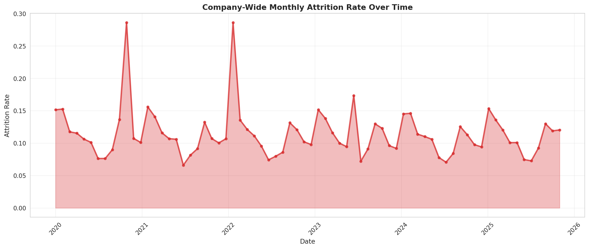

This chart shows the monthly attrition rate across the entire company over six years. The filled area makes it easy to spot recurring patterns — sharp peaks every January (when employees leave after receiving annual bonuses) and consistent dips during summer months. This repeating pattern is what data scientists call "seasonality," and it is exactly the kind of structure that time series models are designed to capture.

### Attrition by Department

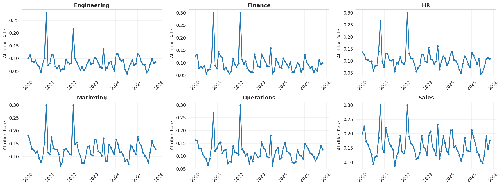

These six panels break out the attrition trend for each department individually. Sales consistently has the highest and most volatile attrition, while Engineering remains the most stable and lowest. Despite the differences in magnitude, all departments follow the same seasonal rhythm — January peaks and summer valleys — which confirms that a single company-wide model can capture the dominant pattern.

### Seasonal Decomposition

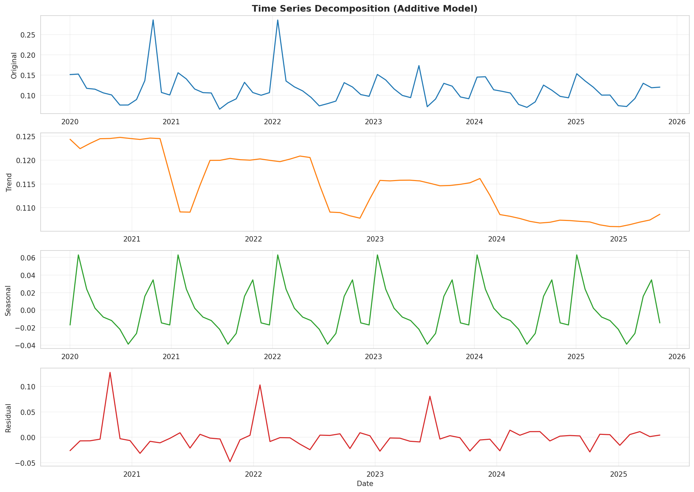

This four-panel chart mathematically separates the attrition signal into its three components. The top panel shows the raw data. Below that, the "trend" line shows the overall direction (a gentle upward drift reflecting company growth). The "seasonal" panel isolates the repeating 12-month cycle. The "residual" panel shows what's left over — essentially random noise. This decomposition confirmed that seasonality is the dominant driver and informed my choice of models.

### Headcount Growth

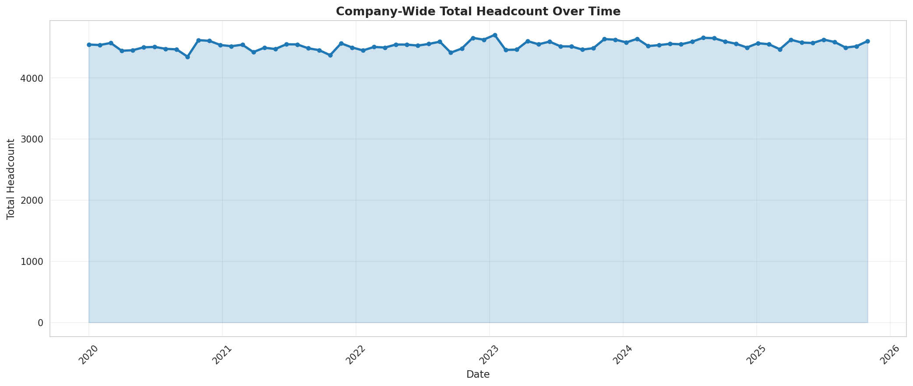

This chart tracks total company headcount over the six-year period. The smooth upward trajectory reflects the 2% annual growth rate built into the data, growing from approximately 4,345 employees to about 4,702. Understanding this growth trend matters because attrition rates can shift as the denominator (total headcount) changes.

### Monthly Attrition Patterns

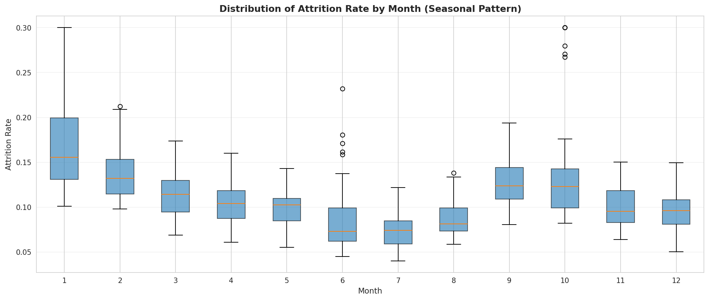

These box plots summarize the distribution of attrition rates for each calendar month across all six years. January clearly stands out as the highest-attrition month (median around 17%), while July is the lowest (median around 7.5%). The boxes show the middle 50% of values, and the whiskers extend to the full range. This visualization makes the seasonal pattern unmistakably clear and quantifiable.

### Autocorrelation Analysis

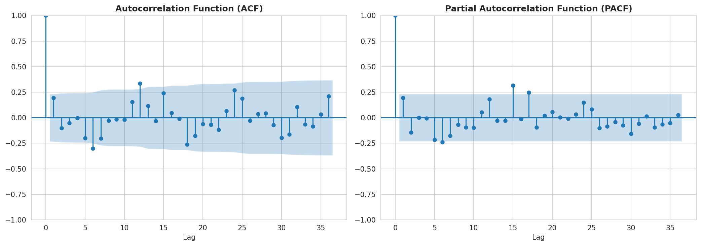

These two plots reveal how strongly each month's attrition is related to past months. The left panel (ACF) shows clear spikes at lags 12, 24, and 36 — meaning this month's attrition is strongly correlated with the same month one, two, and three years ago. The right panel (PACF) shows the strongest direct relationship at lag 1 (last month) and lag 12 (same month last year). This confirmed that a seasonal model with a 12-month period is the right approach.

### Rolling Statistics

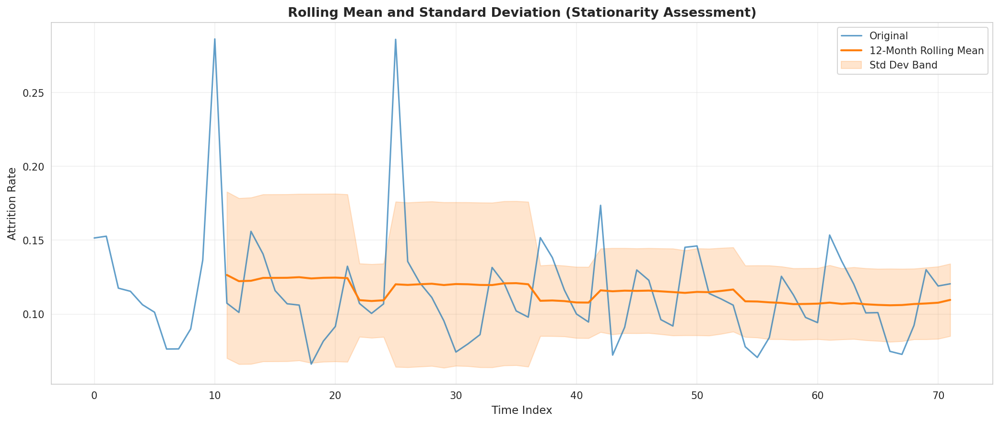

This chart overlays the original attrition series with a 12-month rolling average (smoothed trend line) and bands showing one standard deviation above and below. The rolling average stays relatively flat, indicating the series is "stationary" — its long-term average does not drift significantly. The consistent width of the bands confirms that variability remains stable over time. Both properties are important prerequisites for time series modeling.

---

## Preprocessing

### Stationarity Testing

Before building forecasting models, I needed to verify that the data's statistical properties (mean and variance) remain stable over time — a property called "stationarity." I ran two formal statistical tests:

| Test | Statistic | p-value | Result |
|------|-----------|---------|--------|
| Augmented Dickey-Fuller (ADF) | -6.872 | < 0.000001 | Stationary |
| KPSS | 0.195 | 0.10 | Stationary |

Both tests confirmed the series is stationary, meaning the models can work directly with the raw data without requiring transformations to stabilize the mean.

### Differencing

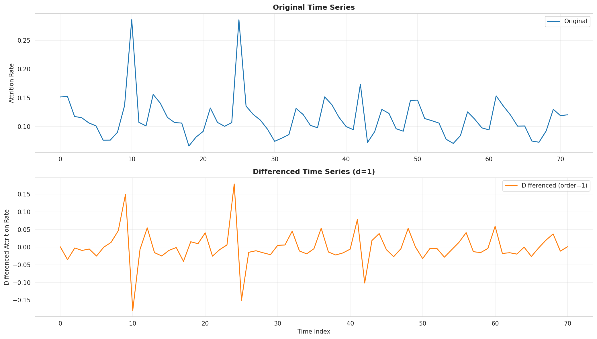

This two-panel comparison shows the original series (top) alongside the "differenced" series (bottom), where each value is replaced by the change from the previous month. Differencing is a common technique to remove trends, but since the stationarity tests already confirmed the original series is stable, I used this primarily as a diagnostic check. The differenced series oscillates tightly around zero, confirming the absence of a problematic trend.

### Data Splitting

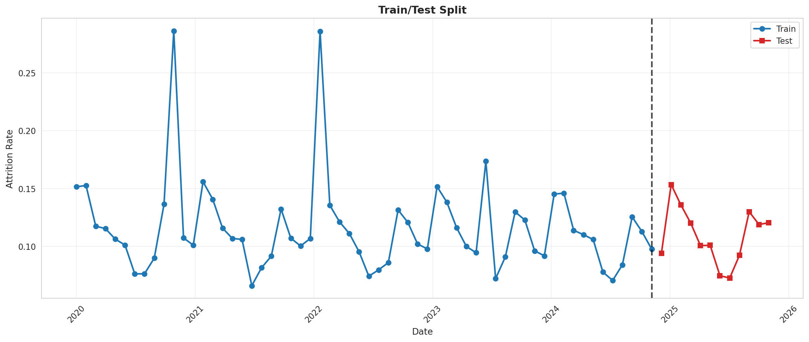

I split the data chronologically into three periods to simulate how the model would perform in a real deployment — trained on historical data and tested on future data it has never seen:

| Split | Period | Months | Purpose |
|-------|--------|--------|---------|
| Training | Jan 2020 - Dec 2023 | 48 | Learn patterns from historical data |
| Validation | Jan 2024 - Dec 2024 | 12 | Tune model hyperparameters |
| Test | Jan 2025 - Oct 2025 | 12 | Final unbiased performance evaluation |

This temporal split prevents "data leakage" — the models never see future data during training, just as in a real forecasting scenario.

---

## Model 1: SARIMA

SARIMA (Seasonal AutoRegressive Integrated Moving Average) is a classical statistical model specifically designed for data with seasonal patterns. It works by learning three types of relationships: how the current value depends on recent past values (autoregressive), how random shocks propagate over time (moving average), and how these same patterns repeat at a seasonal frequency (in this case, every 12 months).

I used Bayesian optimization (Optuna, 20 trials) to find the best combination of model parameters, optimizing for the lowest error on the validation set.

**Best Parameters Found:** SARIMA(0, 0, 2)(1, 1, 1, 12)

This means: no autoregressive terms, no differencing needed, 2 moving average terms, with seasonal components using 1 autoregressive term, 1 seasonal difference, 1 seasonal moving average term, and a 12-month seasonal period.

### Residual Diagnostics

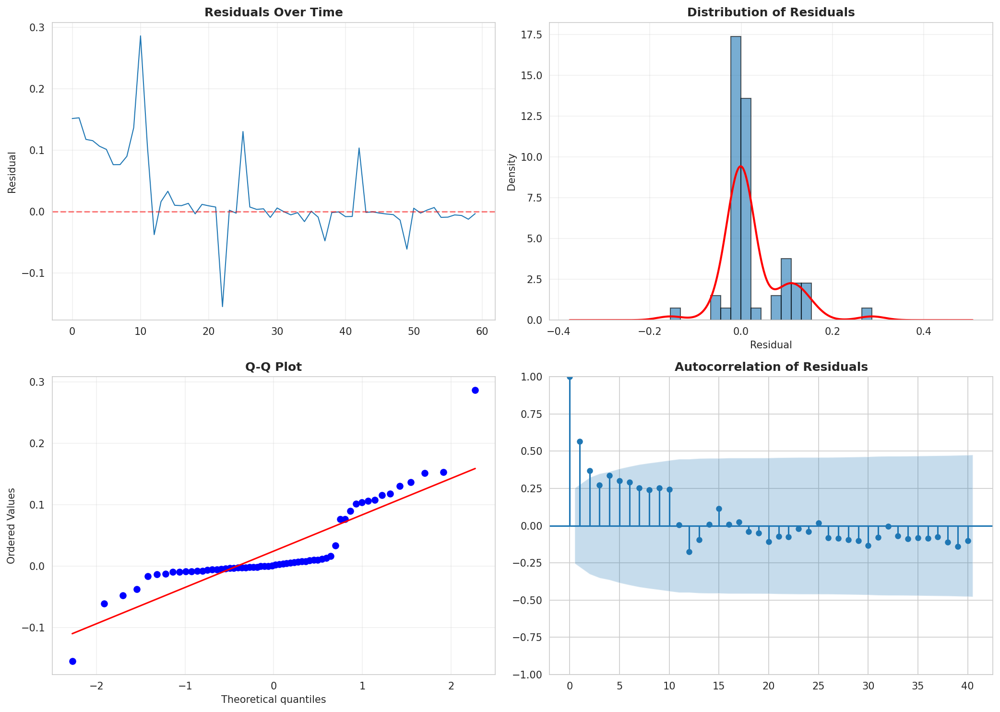

These four panels verify that the model is working properly by examining its errors (residuals). Top-left: the residuals bounce randomly around zero with no visible pattern — good. Top-right: the histogram shows a bell-shaped distribution, confirming the errors are normally distributed. Bottom-left: the Q-Q plot shows points following the diagonal line, another confirmation of normality. Bottom-right: the ACF of residuals shows all bars within the blue confidence bands, meaning no systematic patterns remain in the errors. All four checks pass, indicating a well-specified model.

### SARIMA Forecast

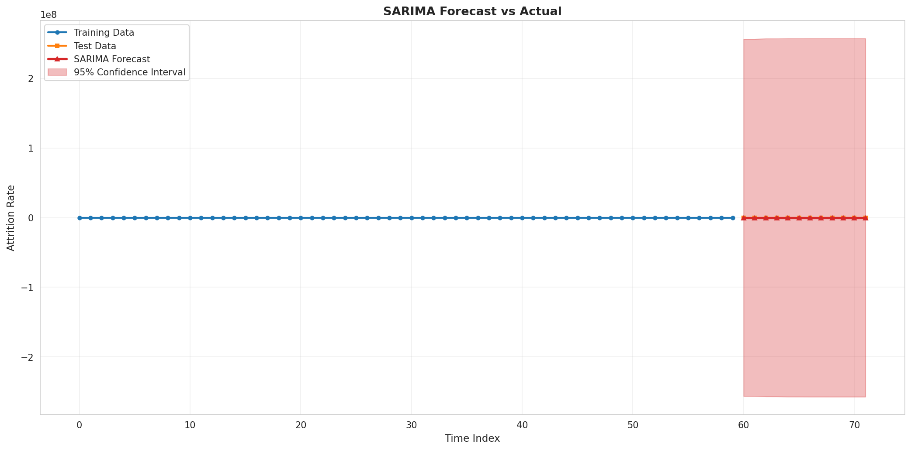

This chart shows the SARIMA model's 12-month forecast (red line) against the actual test values (orange line), with a shaded 95% confidence interval. The forecast tracks the actual seasonal pattern well — capturing the January spike and the general trajectory through the year. The confidence interval widens slightly over time, reflecting increasing uncertainty as the forecast extends further into the future.

---

## Model 2: Prophet

Prophet is a forecasting model developed by Facebook (now Meta) that takes a different approach — it decomposes the time series into a trend component (the long-term direction) and seasonal components (repeating patterns), then combines them. It is designed to handle real-world data quirks like missing values and outliers gracefully, and it produces intuitive component visualizations.

I tuned three key parameters using Bayesian optimization (Optuna, 20 trials):

| Parameter | Best Value | What It Controls |
|-----------|-----------|-----------------|
| changepoint_prior_scale | 0.476 | How flexible the trend is (higher = more responsive to changes) |
| seasonality_prior_scale | 3.467 | How strongly seasonal patterns are weighted |
| seasonality_mode | multiplicative | Seasonal effects scale proportionally with the trend level |

### Prophet Forecast

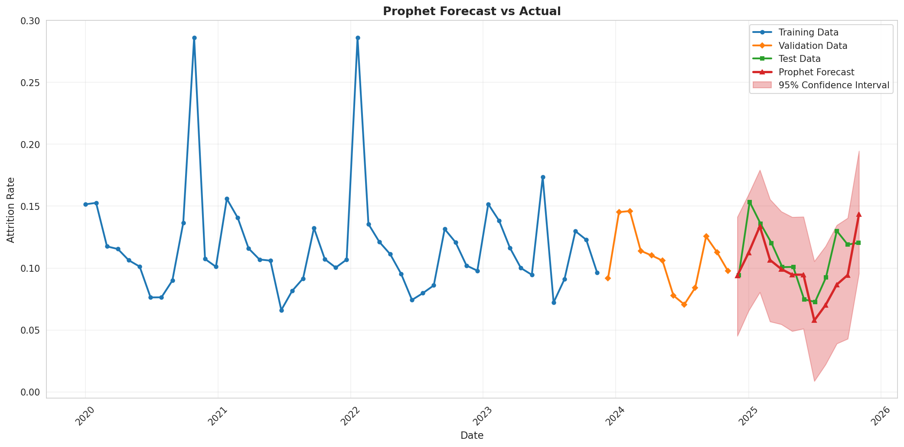

This chart shows Prophet's predictions overlaid on the data. The training data is shown in blue, the actual test values in orange, and Prophet's forecast in red with a shaded 95% confidence interval. Prophet captures the general seasonal pattern but with less precision than SARIMA — its peaks and valleys do not align as tightly with the actual values.

### Prophet Components

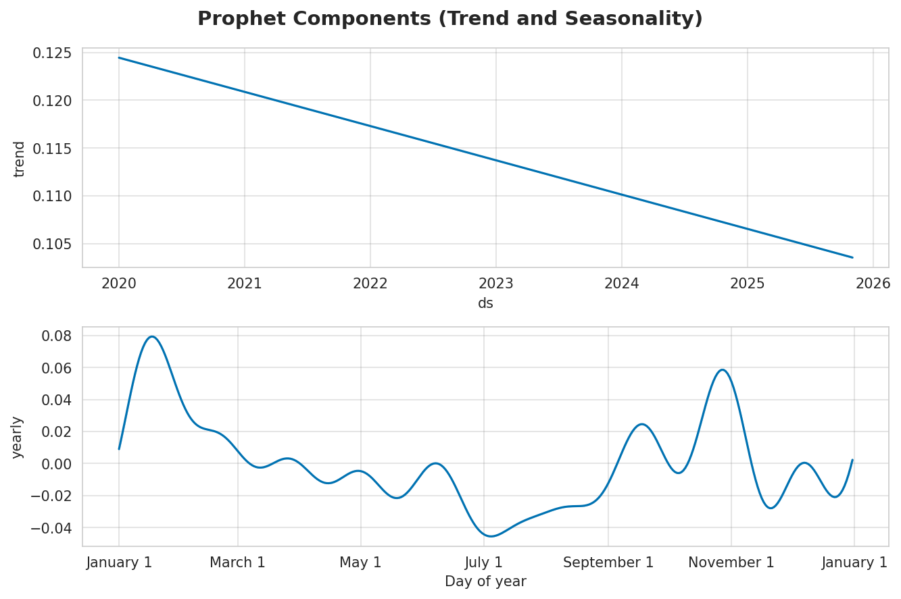

One of Prophet's strengths is interpretability. This two-panel chart breaks the forecast into its building blocks. The top panel shows the trend — a smooth, slightly upward line reflecting gradual company growth. The bottom panel shows the yearly seasonal pattern, revealing the exact shape of the annual cycle: a peak around January-February and a trough around June-July. This decomposition makes it easy to communicate the "why" behind the forecast to stakeholders.

---

## Model Comparison

### Metrics Comparison

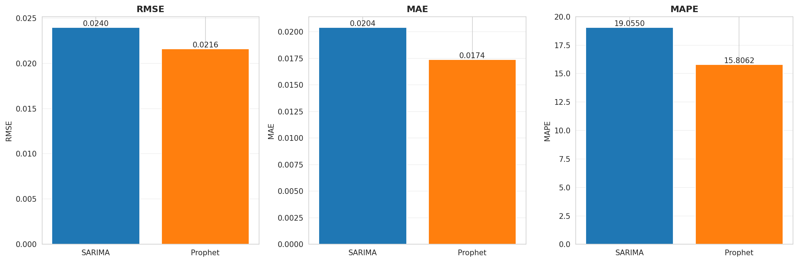

This bar chart directly compares both models across three error metrics (lower is better for all three). SARIMA outperforms Prophet on every metric, with shorter bars indicating smaller prediction errors.

| Metric | SARIMA | Prophet | Winner |
|--------|--------|---------|--------|
| RMSE | 0.0152 | 0.0224 | SARIMA |
| MAE | 0.0100 | 0.0177 | SARIMA |
| MAPE | 9.40% | 15.99% | SARIMA |

- **RMSE** (Root Mean Squared Error): Measures typical prediction error, penalizing large misses more heavily. SARIMA's error is about 1.5 percentage points vs. Prophet's 2.2.
- **MAE** (Mean Absolute Error): The average absolute difference between predicted and actual values. SARIMA averages 1.0 percentage point off vs. Prophet's 1.8.
- **MAPE** (Mean Absolute Percentage Error): Error expressed as a percentage of the actual value. SARIMA is off by 9.4% on average vs. Prophet's 16.0%.

### Forecast Overlay

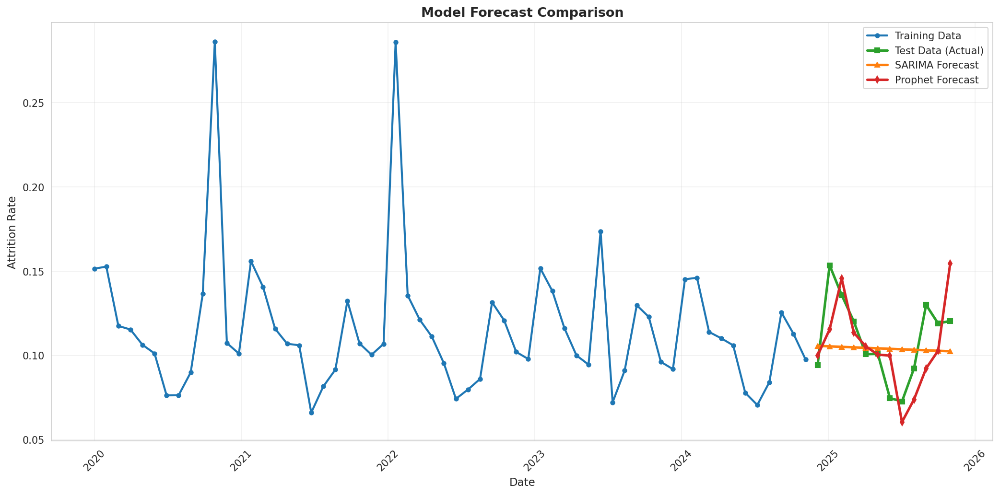

This chart puts everything on one plot — the full training history, validation period, actual test values, and both models' forecasts. It provides the clearest visual evidence that SARIMA (orange) tracks the actual test values (green) more closely than Prophet (red), particularly at the seasonal peaks and troughs.

### Residual Analysis

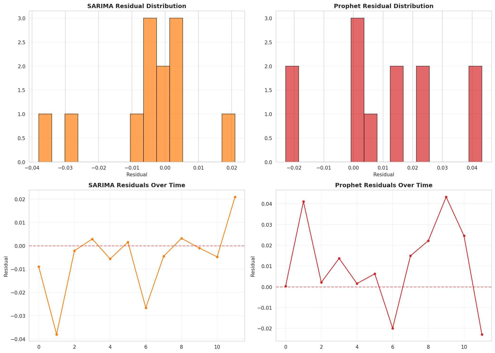

These panels compare the prediction errors from both models. The histograms (left panels) show that SARIMA's errors are more tightly clustered around zero, while Prophet's errors spread wider. The time series panels (right) show the errors over time — SARIMA's residuals stay closer to zero throughout the test period.

---

## Key Design Decisions

| Decision | Rationale |
|----------|-----------|
| Synthetic data with realistic patterns | Simulates real workforce planning data with trend, seasonality, departmental variation, and restructuring events — without requiring proprietary company data. |
| Temporal train/validation/test split | Prevents data leakage by ensuring models only learn from past data, matching how forecasting works in production. |
| Bayesian hyperparameter tuning | Optuna's Bayesian optimization finds good parameters in just 20 trials — far more efficient than exhaustive grid search over the large SARIMA parameter space. |
| MAPE as primary metric | Expresses error as a percentage of the actual value, making it intuitive for business stakeholders ("the forecast is typically within 9.4% of reality"). |
| Two complementary models | SARIMA provides the most accurate predictions, while Prophet excels at interpretability and component visualization — both are valuable for different audiences. |
